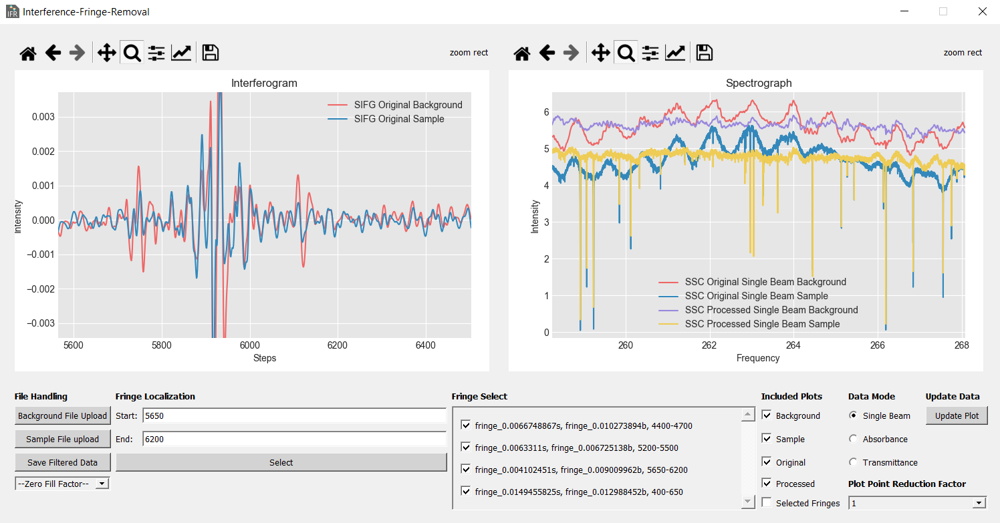

#  Interference-Fringe-Removal (IFR)

The IFR project is a data handling user interface for the FAR-IR beamline of the Canadian Light Source Inc.. The platform uses an in house method to remove interference fringes from OPUS FTIR spectrograph data.

## User-Interface

The Interference-fringe-Removal functionality is accessible through the use of a user interface that initializes by running the `IFR/main.py` script.

A typical work flow should emulate the following pattern:
1. Load sample and background data,
2. Locate all fringes in the interferogram and select them by adding in their bounds to the "Fringe Localization" window,
3. Using the "Fringe Select" window, check which fringes to remove,
4. Select plotting preferences using the "Included Plots" and "Data Mode" check boxes and radio buttons,
5. Update the spectrograph plot by pressing the "Update Plot" button.
6. Iterate steps 3 - 5 until satisfied with the resulting data, and
7. Save the sample and background spectrograph data as well as the removed fringe locations as `.dpt` files using the "Save Filtered Data" button.

## Data Requirements
The program assumes that the inputted OPUS (`.0`) files have an interferogram data block that meets the requirements of being:

* Appropriatly Apodized,
* Phase Corrected,
* Single Sided, and
* Mono-Directional.

The inputted OPUS files must also contain a single beam spectrograph data block. Example OPUS data files can be seen in the `IFR/data` folder.
